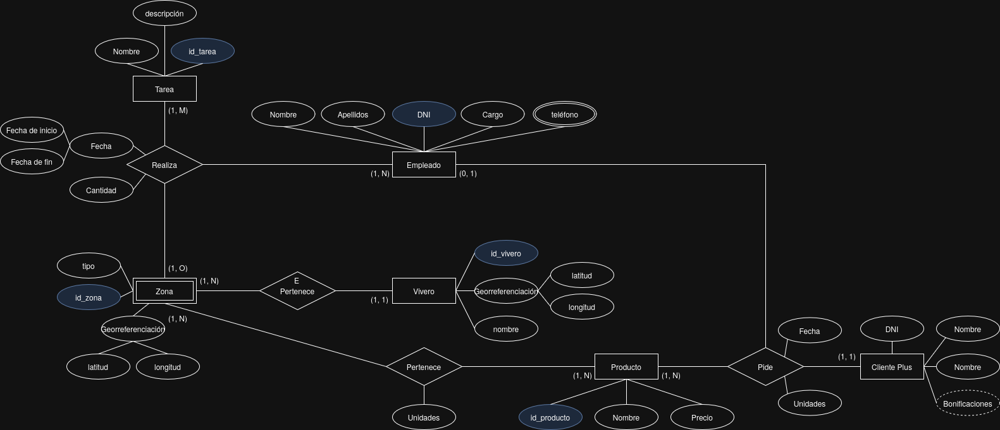
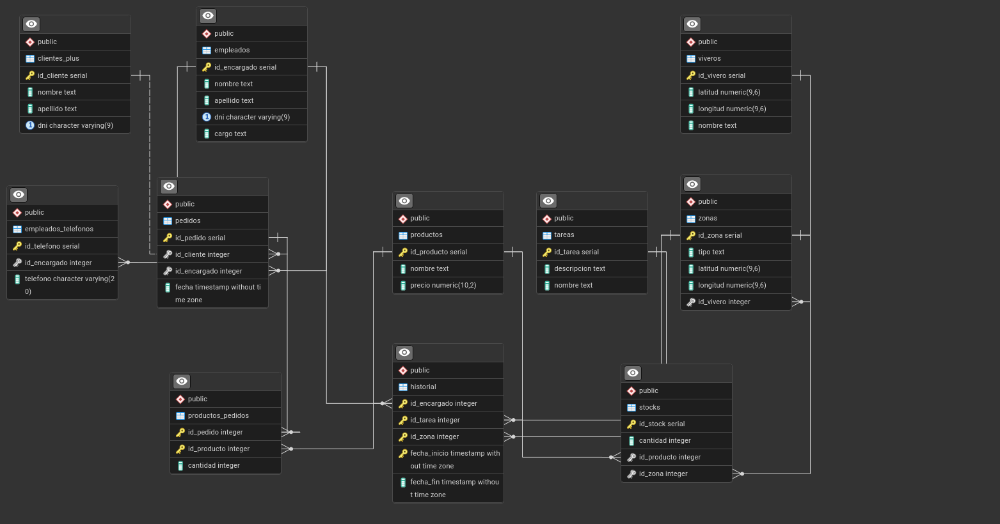

# Práctica 4 - Administración y Diseño de Bases de Datos

## Sistema de Gestión de Viveros

### Descripción del Proyecto

Partiendo del modelo entidad-relación sobre viveros ya elaborado, se ha realizado el modelo relacional asociado a este escenario. Este proyecto implementa una base de datos completa para la gestión de viveros que incluye la administración de productos, empleados, clientes, pedidos, zonas y tareas.

### Modelo Entidad-Relación

El diseño inicial del sistema se basa en el siguiente modelo entidad-relación:



### Modelo Relacional

A partir del modelo E-R, se ha desarrollado el siguiente modelo relacional:



### Características del Script SQL

El script SQL generado para PostgreSQL (`script.sql`) incluye las siguientes características:

#### 1. Creación de Tablas

Se han creado las siguientes tablas con sus respectivas restricciones:

- **viveros**: Información de los viveros con coordenadas geográficas.
- **productos**: Catálogo de productos disponibles.
- **empleados**: Información del personal.
- **clientes_plus**: Base de clientes registrados.
- **zonas**: Diferentes áreas dentro de cada vivero.
- **pedidos**: Registro de pedidos realizados.
- **productos_pedidos**: Detalle de productos por pedido (tabla de relación).
- **stocks**: Control de inventario por zona.
- **empleados_telefonos**: Teléfonos de contacto de empleados.
- **tareas**: Catálogo de tareas disponibles.
- **historial**: Registro histórico de tareas realizadas.

#### 2. Tipos de Datos Utilizados

- **SERIAL**: Para claves primarias autoincrementales.
- **TEXT**: Para campos de texto de longitud variable.
- **NUMERIC(p,s)**: Para valores monetarios y coordenadas geográficas.
- **VARCHAR(n)**: Para campos con longitud limitada (DNI, teléfonos).
- **INT**: Para claves foráneas y cantidades.
- **TIMESTAMP**: Para fechas y horas.

#### 3. Restricciones CHECK Implementadas

```sql
-- Validación de coordenadas geográficas
CHECK (latitud BETWEEN -90 AND 90)
CHECK (longitud BETWEEN -180 AND 180)

-- Validación de precios no negativos
CHECK (precio >= 0)

-- Validación de formato DNI español
CHECK (dni ~ '^[0-9]{8}[A-Za-z]$')

-- Validación de cantidades no negativas
CHECK (cantidad >= 0)

-- Validación de formato de teléfono
CHECK (telefono ~ '^[0-9+() \\-]{6,20}$')

-- Validación de fechas en historial
CHECK (fecha_fin IS NULL OR fecha_fin >= fecha_inicio)
```

#### 4. Políticas de Integridad Referencial (ON DELETE)

Las políticas implementadas responden a la lógica de negocio:

##### CASCADE (Eliminación en Cascada)

- **viveros → zonas**: Si se elimina un vivero, se eliminan todas sus zonas.
- **zonas → stocks**: Si se elimina una zona, se elimina su inventario.
- **empleados → empleados_telefonos**: Si se elimina un empleado, se eliminan sus teléfonos.
- **pedidos → productos_pedidos**: Si se elimina un pedido, se eliminan sus detalles.
- **empleados → historial**: Si se elimina un empleado, se elimina su historial.
- **zona → historial**: Si se elimina una zona, el historial de esta se elimina.

##### RESTRICT (Restricción de Eliminación)

- **clientes_plus → pedidos**: No se puede eliminar un cliente que tenga pedidos.
- **productos → productos_pedidos**: No se puede eliminar un producto que esté en pedidos.
- **tareas → historial**: No se puede eliminar una tarea que esté en el historial.

##### SET NULL (Establecer Nulo)

- **empleados → pedidos**: Si se elimina un empleado, sus pedidos quedan sin encargado asignado.

#### 5. Datos de Prueba

Se han insertado al menos 5 registros en cada tabla para cubrir todos los escenarios posibles:

## Script SQL Completo

A continuación se presenta el script completo implementado:

```sql
CREATE TABLE viveros (
  id_vivero SERIAL PRIMARY KEY,
  latitud NUMERIC(9,6) NOT NULL CHECK (latitud BETWEEN -90 AND 90),
  longitud NUMERIC(9,6) NOT NULL CHECK (longitud BETWEEN -180 AND 180),
  nombre TEXT NOT NULL
);


CREATE TABLE productos (
  id_producto SERIAL PRIMARY KEY,
  nombre TEXT NOT NULL,
  precio NUMERIC(10,2) NOT NULL CHECK (precio >= 0)
);


CREATE TABLE empleados (
  id_encargado SERIAL PRIMARY KEY,
  nombre TEXT NOT NULL,
  apellido TEXT NOT NULL,
  dni VARCHAR(9) UNIQUE NOT NULL CHECK (dni ~ '^[0-9]{8}[A-Za-z]$'),
  cargo TEXT NOT NULL
);


CREATE TABLE clientes_plus (
  id_cliente SERIAL PRIMARY KEY,
  nombre TEXT NOT NULL,
  apellido TEXT NOT NULL,
  dni VARCHAR(9) UNIQUE NOT NULL CHECK (dni ~ '^[0-9]{8}[A-Za-z]$')
);


CREATE TABLE zonas (
  id_zona SERIAL PRIMARY KEY,
  tipo TEXT NOT NULL,
  latitud NUMERIC(9,6) NOT NULL CHECK (latitud BETWEEN -90 AND 90),
  longitud NUMERIC(9,6) NOT NULL CHECK (longitud BETWEEN -180 AND 180),
  id_vivero INT NOT NULL REFERENCES viveros(id_vivero) ON DELETE CASCADE
);


CREATE TABLE pedidos (
  id_pedido SERIAL PRIMARY KEY,
  id_cliente INT NOT NULL REFERENCES clientes_plus(id_cliente) ON DELETE RESTRICT,
  id_encargado INT REFERENCES empleados(id_encargado) ON DELETE SET NULL,
  fecha TIMESTAMP NOT NULL
);


CREATE TABLE productos_pedidos (
  id_pedido INT NOT NULL REFERENCES pedidos(id_pedido) ON DELETE CASCADE,
  id_producto INT NOT NULL REFERENCES productos(id_producto) ON DELETE RESTRICT,
  cantidad INT NOT NULL CHECK (cantidad >= 0),
  PRIMARY KEY (id_pedido, id_producto)
);


CREATE TABLE stocks (
  id_stock SERIAL PRIMARY KEY,
  cantidad INT NOT NULL CHECK (cantidad >= 0),
  id_producto INT NOT NULL REFERENCES productos(id_producto) ON DELETE CASCADE,
  id_zona INT NOT NULL REFERENCES zonas(id_zona) ON DELETE CASCADE
);


CREATE TABLE empleados_telefonos (
  id_telefono SERIAL PRIMARY KEY,
  id_encargado INT NOT NULL REFERENCES empleados(id_encargado) ON DELETE CASCADE,
    telefono VARCHAR(20) NOT NULL CHECK (telefono ~ '^[0-9+() \\-]{6,20}$')
);


CREATE TABLE tareas (
  id_tarea SERIAL PRIMARY KEY,
  descripcion TEXT NOT NULL,
  nombre TEXT NOT NULL
);


CREATE TABLE historial (
  id_encargado INT NOT NULL REFERENCES empleados(id_encargado) ON DELETE CASCADE,
  id_tarea INT NOT NULL REFERENCES tareas(id_tarea) ON DELETE RESTRICT,
  id_zona INT NOT NULL REFERENCES zonas(id_zona) ON DELETE CASCADE,
  fecha_inicio TIMESTAMP NOT NULL,
  fecha_fin TIMESTAMP,
  PRIMARY KEY (id_encargado, id_tarea, id_zona, fecha_inicio),
  CHECK (fecha_fin IS NULL OR fecha_fin >= fecha_inicio)
);


INSERT INTO viveros (latitud, longitud, nombre) VALUES
  (40.416775, -3.703790, 'Vivero Centro'),
  (41.385063, 2.173404, 'Vivero Barcelona'),
  (37.389092, -5.984459, 'Vivero Sevilla'),
  (43.362343, -8.411540, 'Vivero Galicia'),
  (-34.603722, -58.381592, 'Vivero Buenos Aires');


INSERT INTO productos (nombre, precio) VALUES
  ('Rosal', 12.50),
  ('Pino', 25.00),
  ('Cactus', 8.75),
  ('Abono 5kg', 15.00),
  ('Maceta 20cm', 4.20);


INSERT INTO empleados (nombre, apellido, dni, cargo) VALUES
  ('Ana', 'García', '12345678A', 'Encargada'),
  ('Luis', 'Martínez', '23456789B', 'Reponedor'),
  ('María', 'Fernández', '34567890C', 'Encargada'),
  ('Pedro', 'Santos', '45678901D', 'Transportista'),
  ('Lucía', 'Vega', '56789012E', 'Administración');


INSERT INTO empleados_telefonos (id_encargado, telefono) VALUES
  (1, '+34 600111222'),
  (2, '+34 600222333'),
  (3, '+34 600333444'),
  (4, '+34 600444555'),
  (5, '+34 600555666');


INSERT INTO clientes_plus (nombre, apellido, dni) VALUES
  ('Carlos', 'Lopez', '87654321Z'),
  ('Sofia', 'Ruiz', '76543210Y'),
  ('Diego', 'Molina', '65432109X'),
  ('Elena', 'Ortega', '54321098W'),
  ('Mateo', 'Pérez', '43210987V');


INSERT INTO zonas (tipo, latitud, longitud, id_vivero) VALUES
  ('Invernadero', 40.417000, -3.704000, 1),
  ('Exterior', 41.385500, 2.174000, 2),
  ('Almacén', 37.389300, -5.984800, 3),
  ('Exposición', 43.362600, -8.412000, 4),
  ('Crianza', -34.603900, -58.381800, 5);


INSERT INTO stocks (cantidad, id_producto, id_zona) VALUES
  (20, 1, 1),
  (15, 2, 2),
  (50, 3, 3),
  (100, 4, 4),
  (200, 5, 5);


INSERT INTO pedidos (id_cliente, id_encargado, fecha) VALUES
  (1, 1, '2025-01-10 10:00:00'),
  (1, 2, '2025-02-05 11:15:00'),
  (2, 1, '2025-03-02 09:30:00'),
  (3, 3, '2025-04-12 16:45:00'),
  (4, 1, '2025-05-20 08:00:00');


INSERT INTO productos_pedidos (id_pedido, id_producto, cantidad) VALUES
  (1, 1, 2),
  (1, 4, 1),
  (2, 2, 1),
  (3, 3, 5),
  (4, 5, 10),
  (5, 1, 1),
  (2, 5, 2);


SELECT recalc_bonificaciones(id_cliente) FROM clientes_plus;


INSERT INTO tareas (descripcion, nombre) VALUES
  ('Riego de invernadero', 'Riego'),
  ('Poda de rosales', 'Poda'),
  ('Control de plagas', 'Plagas'),
  ('Inventario mensual', 'Inventario'),
  ('Traslado plantas', 'Traslado');


INSERT INTO historial (id_encargado, id_tarea, id_zona, fecha_inicio, fecha_fin) VALUES
  (1, 1, 1, '2025-01-05 08:00:00', '2025-01-05 10:00:00'),
  (2, 2, 2, '2025-02-10 09:00:00', '2025-02-10 12:00:00'),
  (3, 3, 3, '2025-03-15 14:00:00', NULL),
  (4, 5, 4, '2025-04-01 07:30:00', '2025-04-01 09:00:00'),
  (1, 4, 1, '2025-05-02 09:00:00', '2025-05-02 11:00:00');
```
